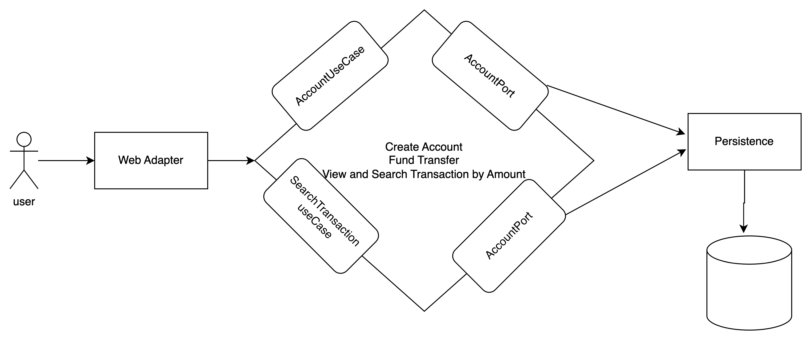

## cashwithdraw using clean code architecture

```
Java 11
In-memory H2 Database
Docker
```

### You can run it from Docker image or do maven compile

### Docker image Compilation

```
Build the Jar file
mvn clean package

Build the image :  
docker build -t cashwithdrawal:latest .

Start the Docker Container in detach mode
docker run -d -p 8181:8181 -t cashwithdrawal:latest 
```

### Spring Boot run

`mvn spring-boot:run`

### Run Spring example

`java -jar application/spring-app/build/libs/spring-app-1.0.0.jar`

### Apis details also available on the postman collection

#### Basic Authentication
```
Username : moses
password : password1@

and

username: john
password: password1@
```
#### Create or Configure New Virtual Account 
```
POST: http://localhost:8181/accounts
Body:
{
    "surname": "surname",
    "firstname": "moses",
    "routingNumber": "028444018",
    "nin": "dfre345",
    "accountNumber": "0245253419",
    "currency": "USD",
    "bankName": "West Bank",
    "balance": 5000
}
```
#### Get all account
```
GET: http://localhost:8181/accounts
```
#### Fund Transfer from virtual account
```
POST: http://localhost:8181/accounts/payment
Body:
{
    "source": {
        "type": "COMPANY",
        "sourceInformation": {
            "name": "ONTOP INC"
        },
        "account": {
            "accountNumber": "0245253419",
            "currency": "USD",
            "routingNumber": "028444018"
        }
    },
    "destination": {
        "name": "TONY STARK",
        "account": {
            "accountNumber": "1885226711",
            "currency": "USD",
            "routingNumber": "211927207"
        }
    },
    "amount": 300
}
```
#### Get all transaction activity
```
GET: http://localhost:8181/transaction/search
```

#### Get transaction by amount
```
GET: http://localhost:8181/transaction/search?amount=470
```


